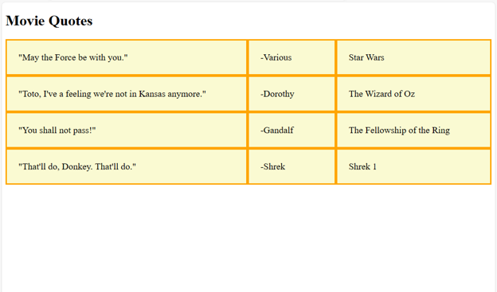

# Positioning Data in Rows and Columns Using CSS

## Introduction:
In this tutorial we will be writing a simple webpage in HTML and creating a style sheet in CSS in order to format the content into rows and columns. For this example we will be displaying movie quotes alongside who said them and what movie they are from. Below are the technologies that we will be using:
- VS Code - Microsoft Visual Studio Code is a feature-rich code editor available for Windows, macOS, and Linux. VS Code allows us to create and edit files in many different programming, markup, and style languages. There are a host of helpful extensions available to install based on what you need. We will be using VS Code in this tutorial to provide an introduction to a very useful tool for more complex projects, but you could accomplish the same tasks in editors such as notepad++, Sublime, or Vim. It is not to be confused with Microsoft Visual Studio Code IDE (See VS vs VS Code below).
- HTML - HTML, or Hyper Text Markup Language, is the language in which the structure and content of a web page are written. An HTML document is made up of several elements such as titles, lists, or paragraphs.
- CSS - CSS, or Cascading Style Sheets, is the language in which we format the style and layout of our webpage. There exist premade stylesheets, but in this tutorial we will be learning how to make our own and apply it to our HTML page. 

## Tutorial

### Set Up Your Tools and File Structure
1. Download and install VS Studio Code for your operating system from [their website](https://code.visualstudio.com/) (The Stable Build option is recommended) This will be our main tool for this project as it allows us to edit our HTML and CSS code.

1. In your documents create a new folder for this project, I will call mine "tutorial". 

1. Open VS Code and on the Welcome tab click “open folder.” Then select the folder you made in the previous step. Click “trust” if asked. 

1. On the left side of the window hover over your folder name with your mouse and click “new file.”


5. Create a file called “index.html.” The “.html” file extension indicates that this will house our HTML document and the content of the page. 

1. Create a file called “style.css.” The “.css” file extension indicates that this will house our CSS and the styling for our page.

### Create a Basic HTML Page With Content
1. Click on “index.html” within VS Code to open it for editing.

1. Enter in the following HTML code. The first line indicates that this is an HTML page and tells the browser we are using HTML 5. The second line begins our html document, also indicating that we will be using English (“en”). The final line indicates the end of the html document.

```
<!DOCTYPE html> <!--Tells browser we are using HTML 5-->
<html lang="en"> <!--Begins HTML doc and language is English-->

</html> <!--Ends HTML doc-->`
```
3. Now we need to add a `<head>` element. Add the following code between `<html land=”en”>` and `</html>`. The `<head>` element contains metadata about the page. The `<link>` element connects the page to our "style.css". CSS can be implemented within your "index.html", but there are benefits to using a separate file such as organization and the ability to reuse this stylesheet on other pages. Set the text between the `<title>` elements to whatever you would like the title of your browser tab to be. Since this tutorial focuses on CSS, just copy the other lines for now.

```
<head>
    <link rel="stylesheet" href="style.css"> <!--links to stylesheet-->
    <meta charset="utf-8" />
    <meta name="viewport" content="width=device-width, initial-scale=1.0" />
    <title>Movie Quotes</title> <!--title to be displayed on tab-->
</head>
```

4. Add the following code below the end of `<head>`. The `<body>` element indicates the start of our actual content. The `<h1>` element is our on-page title. The `<span>` elements display the text on screen. There are several different types of HTML elements to display text, but `<span>` will do well for these smaller portions of text. `<p>` indicates a paragraph and will work well for housing our whole quotes text.  Within the `<p>` copy and paste the sets of 3 `<span>` elements a couple of times and change the text inside to your favorite movie quotes. 

```
<body> 
    <h1>Movie Quotes</h1> <!--page title-->
<p>
    <span>"May the Force be with you."</span> <!--text to be displayed-->
    <span>-Various</span>
    <span>Star Wars</span>
<p>
</body>
```

5. We now have a basic HTML page! Make sure to save your "index.html" and then open it from your file manager. It should open in your default browser and look like this: 


6. Our text is just one long line, wrapping at the end of your screen. This is pretty ugly and hard to read, so now we need to format our movie quotes into a grid using CSS.

### Format Content Into Rows and Columns

1. Add the necessary code so that your `<p>` opener looks like this. Naming a class for our `<p>` element allows us to select it from our CSS. 

```
<p class="thegrid">
```

2. Now go to your "style.css" file within VS Code and add the following code. The "`.`" indicates that we are selecting a class, which is named `thegrid` to match the class of our `<p>` element. `Display:` is the property we wish to alter and `grid` is the value we are setting it to. The `;` simply indicates the end of the line of code. Similarly, `grid-template-columns:` is a property and we are setting 3 columns to `auto` since we have 3 fields for each of our quotes.

```
.thegrid { 
    display: grid;
    grid-template-columns: auto auto auto;
}
```

3. After saving your files and refreshing your browser, your page should be organized in rows and columns, but it still just looks like basic, boring text. We want our rows and columns to have borders so it looks more like a table. We also want to adjust the sizing and colors to make it more visually appealing.

1. Add the following code to the bottom of "style.css". We are selecting the class `.griditem` and setting it’s properties. `border:` sets the border weight in pixels, the pattern type, and the color (in RGB or pre-set colors like `orange`). `padding:` adds padding in pixels around the text inside each box. `background-color:` sets the background color, and `font-size:` sets the size of the text in pixels.

```
.griditem {
    border: 3px solid orange;
    padding: 25px;
    background-color: lightgoldenrodyellow;
    font-size: 20px;
}
```

5. In order for this CSS to have any effect we need to add the `griditem` class to each `<span>` just like this:

```
    <span class="griditem">"May the Force be with you."</span>
```

6. After saving your both of your files and refreshing your browser, your page should look like this. Much better! You’ve now successfully formatted your data in rows and columns, and made it more visually appealing as well.



7. If you would like to further customize your grid see the [CSS Grid Layout Module](https://www.w3schools.com/css/css_grid.asp) link below.

1. In addition, there are several different ways to format your HTML data in rows and columns. Included in the resources below is [one other way](https://www.w3schools.com/html/html_tables.asp) to do this.


## Additional Resources

[Learn Visual Studio Code in 7min](https://youtu.be/B-s71n0dHUk) - This short YouTube Video is a great guide to using and navigating VS Code. It is at a beginners level and shows basic functions of the software as well as some examples of how to use it with JavaScript, Python, and HTML. Even if you are not familiar with or currently learning JavaScript or Python, the whole video is helpful as it shows you how to use various VS Code features. 

[HTML: HyperText Markup Language](https://developer.mozilla.org/en-US/docs/Web/HTML) - Mozilla’s web docs are a great resource for learning about and referencing HTML, CSS, and JavaScript. This specific page is an intro to HTML. It explains what it is and links to additional resources and tutorials. The first four paragraphs may be helpful to read before further study of HTML.

[CSS Introduction](https://www.w3schools.com/Css/css_intro.asp) - W3 Schools is another great resource for web development and programming in general. W3 covers HTML, CSS, JavaScript, Python, SQL, PHP, jQuery, Java, C++, Bootstrap, C, C#, and much more. Specifically for web development this is my personal favorite site to reference. This specific page introduces CSS and shows a demo of how it can be used. The chapters on the navigation bar on the left side of the page are fantastic resources for individual CSS features.

[CSS Grid Layout Module](https://www.w3schools.com/css/css_grid.asp) - This W3 page explains the CSS Grid Layout used in this tutorial. It shows the syntax and gives examples of how to use it. 

[Visual Studio vs Visual Studio Code](https://www.freecodecamp.org/news/visual-studio-vs-visual-studio-code/) - This page explains the difference between Visual Studio and Visual Studio Code. VS is an IDE (integrated development environment) while VS Code is a code editor. If you are unsure which you should be using for your project, give this article a read.

[HTML Tables](https://www.w3schools.com/html/html_tables.asp) This page explains an alternative method of creating tables with rows and columns. This method involves using the HTML tag “table” and is pretty simple, but can be spiced up with CSS.
